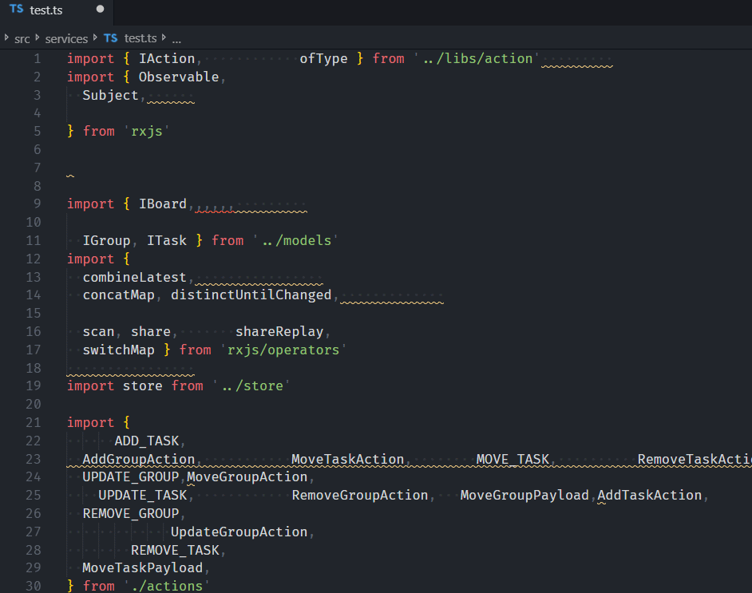

# import-beautify

VSCode extension to help grouping and beautify import statments.

## Preview

## Features

- [x] Group by Regexp, support child groups
- [x] Order by names and path, support custom order direction and case-first
- [x] Configuration with tab style, quotemark, trailing comma, semicolon...
- [x] Beautify before save
- [x] Path rewriting
- [ ] Combine same paths
- [ ] Project-base configuration
- [ ] Allow exclude files

# Inspiration

- [import-sorter](https://github.com/SoominHan/import-sorter)

- [sort-typescript-imports](https://github.com/MLoughry/sort-typescript-imports)
